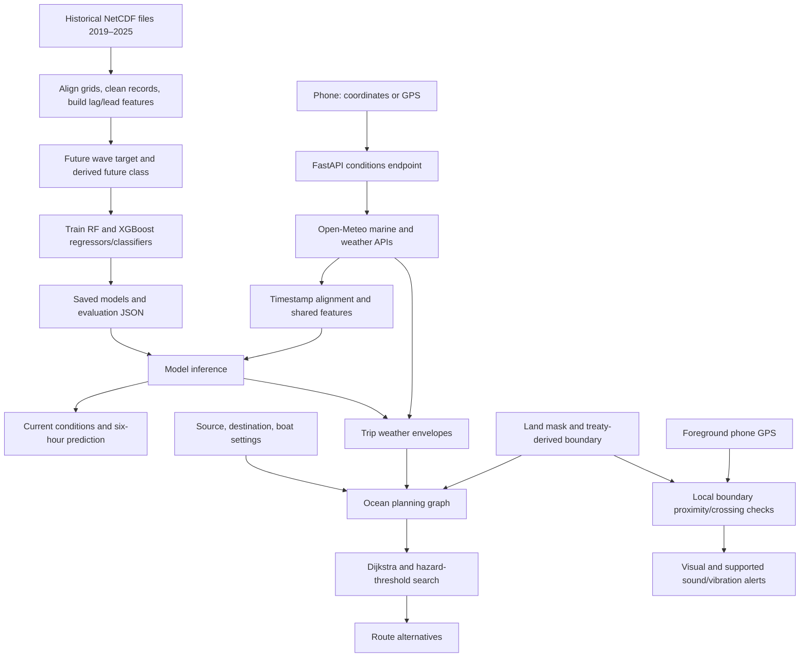

# Kadal: Fishermen Safety Prediction and Route Advisory System

Implementation report • 17 September 2026

This report describes the code and saved results currently in this workspace. It distinguishes implemented features, measured results, and work still required. It is suitable as a technical project reference and a foundation for a college report; it is not a claim of certified navigation, government endorsement, or publication acceptance.

## 1. Project identity and abstract

**Title:** Fishermen Safety Prediction and Route Advisory System for the Tamil Nadu Region.

**Application name:** Kadal (கடல்). **Domains:** machine learning, data analytics, geographic decision support and mobile web applications. **Intended SDG connection:** SDG 14, Life Below Water. **Intended users:** fishermen, boat operators, coastal stakeholders and project evaluators.

Kadal is an installable mobile web application that retrieves sea conditions for a user-entered latitude and longitude or GPS location, predicts significant wave height and a project-derived risk category six hours ahead, and compares offshore routes. Historical ECMWF NetCDF data from 2019–2025 support training and evaluation of Random Forest and XGBoost regressors and classifiers. Live numerical forecasts supply the same feature structure during operation. The route planner excludes mapped land, excessive weather risk, vessel-limit violations and the mapped Sri Lankan side of the India–Sri Lanka maritime boundary. It compares the shortest feasible route with the route having the lowest peak estimated hazard, then the shortest distance at that hazard. A foreground GPS monitor provides boundary-proximity and crossing alerts. The system is a research prototype with retrospective predictive evaluation and automated tests; prospective at-sea accuracy, physical phone operation and stakeholder usefulness remain to be evaluated.

## 2. Problem, objectives and scope

A direct line between two sea locations may cross land, severe weather, a maritime boundary or areas outside the boat's selected operating limits. Separately checking forecasts and plotting a route makes these constraints harder to compare.

The project brings location-based forecasts, predictive risk classification, route comparison and border awareness into one interface. Its concrete objectives are to:

1. Read and preprocess the supplied historical ocean/weather files.
2. Create traceable Safe/Moderate/Danger targets from published government sea-state guidance.
3. Train and compare Random Forest and XGBoost without using future target values as inputs.
4. Fetch live data automatically from manually entered coordinates or GPS.
5. Show current conditions separately from learned six-hour predictions.
6. Compute routes that prioritise low peak estimated risk and then distance.
7. Warn about proposed border crossings and observed GPS position changes.
8. Provide an installable Android/iPhone web interface and reproducible evaluation artifacts.

Coverage is **7–14°N and 77–81°E**, a study rectangle covering waters around Tamil Nadu. It is not a Tamil Nadu administrative polygon or a national boundary. The current route endpoint separation must be **1–160 km**. All prediction locations and route endpoints must pass an approximate offshore check. Harbour navigation is outside scope.

## 3. What the user enters and sees

### Safety Prediction

The user enters **latitude and longitude**, optionally obtains them using **Use my location**, selects Auto/Random Forest/XGBoost, and taps **Fetch live data & predict**. Wave and wind values are fetched automatically. The current interface does not require manual wave height, wind speed or historical readings.

The results include current wave height, current wind speed, current derived risk, predicted wave height at +6 hours, a historical residual band, predicted risk, both model families' outputs, model class scores, forecast-valid/retrieval timestamps and a provider-based next-24-hours chart. The chart is a provider forecast; it is not 24 separate predictions from the project's six-hour model. Display times use IST; backend feature timestamps use UTC.

### Route Advisory

The user enters a source and destination, selects points on the map or starts from an offshore preset, adjusts boat limits, and taps Compare routes. Results show map paths, distance, estimated duration, maximum wave/wind envelope, project risk class, peak risk measures and descriptive cumulative exposure.

Two routes may be returned: **Shortest feasible** and **Safest then shortest**. They can coincide. A route is not returned when the available search graph cannot satisfy the constraints. A red dashed direct-line preview warns about a border conflict; it is not a navigable route.

### Supporting interface

Model & evidence provides evaluation details and the labelled dataset download. Using Kadal explains installation and limitations. The route section includes Start live GPS, Stop, optional sound, current GPS status and the last alert. Boat warnings remain visible when switching to Safety Prediction.

## 4. Architecture and data flow



The backend serves both JSON APIs and the web interface. No relational database, account system, message broker or cloud deployment is included. Training artifacts and boundary data are files. Forecast caching is in server memory; the service worker caches the app shell and boundary layer, not API forecasts.

## 5. Technology stack and source-file map

| Component | Implementation |
| --- | --- |
| Backend | Python, FastAPI, Uvicorn, Pydantic |
| API client | HTTPX with asynchronous requests |
| Data processing | NumPy, pandas, xarray, netCDF4 |
| Random Forest | scikit-learn |
| Gradient boosting | XGBoost CPU |
| Model persistence | joblib |
| Frontend | HTML, CSS, vanilla JavaScript |
| Map | Leaflet with OpenStreetMap tiles |
| Ocean/land screening | global-land-mask plus sampled clearance checks |
| Installable interface | Web manifest and service worker (PWA) |
| Tests | pytest and Playwright |
| Deployment examples | Docker and Caddy HTTPS reverse proxy |

Exact Python dependencies are pinned in `requirements.txt`; JavaScript test dependencies are recorded in `package-lock.json`. The supplied Docker base is Python 3.14. This report describes installed project dependencies rather than recommending their versions for unrelated projects.

| Path | Responsibility |
| --- | --- |
| `DataSet/2019` … `DataSet/2025` | Original supplied historical files |
| `ml/features.py` | Shared training/live feature construction |
| `ml/train.py` | Historical preparation, regression training and evaluation |
| `ml/train_classifiers.py` | Derived class targets, classifier training and dataset export |
| `ml/risk_policy.py` | Versioned class rules and explanations |
| `backend/ocean.py` | Live provider requests, timestamp alignment and cache |
| `backend/prediction.py` | Load and execute all four trained models |
| `backend/routing.py` | Grid, weather envelopes, land checks and routing |
| `backend/boundary.py` | Server-side boundary and segment checks |
| `backend/main.py` | API schemas/endpoints and static-file service |
| `web/index.html`, `styles.css`, `app.js` | Mobile interface and interactions |
| `web/boundary.js` | On-device boundary calculations |
| `web/data/maritime-boundary.json` | Shared line, parameters and provenance |
| `scripts/build_boundary.py` | Reproduce boundary geometry |
| `web/sw.js`, `manifest.webmanifest` | Offline shell and installation metadata |
| `tests/` | Backend and desktop/mobile browser verification |
| `artifacts/` | Active trained models, evaluation reports, policy and labelled data |
| `docs/` | Project report and research methodology |
| `unnecessary/` | Restorable caches and historical checks, experiments and screenshots |
| `scripts/run.sh` | Local startup and missing-model training |
| `scripts/live_check.py` | Real-provider smoke check |

## 6. Historical dataset

There are **21 NetCDF files**: three per year for seven years. File metadata identifies the European Centre for Medium-Range Weather Forecasts (ECMWF). The original download request, exact product identification and licence should be retained before publication; metadata alone should not be used to claim a more specific product provenance.

| File family | Variables | Grid | Model use |
| --- | --- | --- | --- |
| Wave instantaneous | `swh`, `mwp`, `mwd` | 15×9, 0.5° | Significant wave height used |
| Atmospheric instantaneous | `u10`, `v10`, `t2m`, `msl`, `sst` | 29×17, 0.25° | Wind components used |
| Accumulated | `tp` | 29×17, 0.25° | Not used in trained predictors |

`swh` is significant wave height, `mwp` mean wave period, `mwd` mean wave direction, `u10`/`v10` horizontal 10 m wind components, `t2m` 2 m temperature, `msl` mean sea-level pressure, `sst` sea-surface temperature and `tp` total precipitation. Training uses six-hour observations. A normal year contains 1,460 timestamps and a leap year 1,464.

Period, direction, temperatures, pressure and precipitation are available historical variables but are not features in the implemented models. Their presence does not establish that the app predicts those variables.

## 7. Preprocessing and the ten input features

The pipeline opens each year's wave and atmospheric files; computes wind magnitude `sqrt(u10² + v10²)`; selects wind values at wave-grid coordinates; merges years; sorts by latitude, longitude and time; and constructs lagged and future columns within each grid cell.

It requires exactly six hours between the previous/current and current/future records. Missing rows are dropped, and current wave, future wave and current wind are checked for nonnegative values. Wind magnitudes arise from a norm. There is no zero imputation for missing ocean conditions, random oversampling or standard scaling. Tree models use the numerical features directly. The current preprocessing does not implement a separate exhaustive outlier-detection process.

| Feature | Meaning |
| --- | --- |
| `wave_now_m` | Wave height at issue time t |
| `wave_6h_ago_m` | Wave height at t−6h |
| `wind_now_ms` | Wind magnitude at t |
| `wind_6h_ago_ms` | Wind magnitude at t−6h |
| `latitude` | Requested/historical latitude |
| `longitude` | Requested/historical longitude |
| `season_sin`, `season_cos` | sin/cos of 2π × day-of-year / 365.25 |
| `hour_sin`, `hour_cos` | sin/cos of 2π × UTC hour / 24 |

Cyclic features avoid treating midnight and the end of the year as far from their immediately following times. The same function builds training and live features.

The regression target is wave height at **t+6h**. The classification target is the derived class computed using wave and wind at **t+6h**. Those future measurements are used only to construct targets, never as predictor inputs. At deployment, actual future observations are not required.

## 8. Class labels and government-source attribution

The historical NetCDF files do **not** contain official Safe/Moderate/Danger annotations. Following the agreed project scope, labels are derived from sea-state guidance in [IMD's Cyclone Warning in India SOP, Table 6.10](https://rsmcnewdelhi.imd.gov.in/images/pdf/sop.pdf#page=174). The three names and aggregation are project choices, not government-issued warning records.

| Class | ID | Implemented rule |
| --- | ---: | --- |
| Safe | 0 | Wave ≤1.25 m and wind <17 knots |
| Moderate | 1 | Wave >1.25 to 2.5 m or wind ≥17 to <22 knots, unless Danger applies |
| Danger | 2 | Wave >2.5 m or wind ≥22 knots |

The more severe wave/wind group wins. One knot equals 1852/3600 m/s, so 17 knots is approximately 8.746 m/s and 22 knots approximately 11.318 m/s. Exact wave thresholds remain in the lower group; wind thresholds enter the higher group. The boundary convention is recorded with a [NOAA-hosted WMO sea-state reference](https://www.nodc.noaa.gov/gtspp/document/codetbls/wmocodes/table3700.html).

For example, 1.0 m waves with 12 m/s wind is Danger despite low waves. A 2.0 m wave with 5 m/s wind is Moderate. These examples explain the rule, not actual live conditions.

Current risk is calculated directly from current values. Future risk is predicted by a trained classifier. “Safe” means the lowest project weather-risk category; it is not an accident probability or a vessel-specific clearance.

## 9. Time-based data split

| Split | Years | Rows | Safe | Moderate | Danger |
| --- | --- | ---: | ---: | ---: | ---: |
| Training | 2019–2023 | 408,912 | 247,879 | 150,026 | 11,007 |
| Validation | 2024 | 81,928 | 51,137 | 28,665 | 2,126 |
| Test | 2025 | 81,704 | 49,431 | 29,693 | 2,580 |

The evaluated splits total **572,544 rows**. The export can contain additional cross-boundary records marked `purged_boundary`; they are not included in these split totals. Issue and target timestamps must be in the relevant split. A previous-year lag can be used because it was already available at issue time.

Validation selects models. Test data evaluate the selected design; they do not select it. No final refit on validation/test is performed. Spatial and temporal rows remain correlated, so the row total should not be presented as that many independent experiments. Danger is a minority class, making accuracy alone inadequate.

## 10. Four trained models

Random Forest combines many independently trained decision trees to reduce variability. XGBoost builds trees sequentially to improve the objective as training progresses. Both can represent nonlinear relationships in structured features; this project does not use neural networks.

| Configuration | RF regressor | RF classifier | XGBoost regressor/classifier |
| --- | --- | --- | --- |
| Trees | 120 | 140 | 300 |
| Maximum depth | 18 | 18 | 6 |
| Minimum leaf samples | 5 | 8 | Library configuration |
| Feature fraction | 0.8 | 0.8 | 0.9 per tree |
| Learning rate | Not applicable | Not applicable | 0.05 |
| Row subsampling | Bootstrap behavior | Bootstrap behavior | 0.85 |
| L2 regularisation | Not applicable | Not applicable | 2 |
| Class balancing | Not applicable | balanced_subsample | Balanced sample weights for classification |
| Random seed / threads | 42 / 4 | 42 / 4 | 42 / 4 |

XGBoost uses CPU histogram training; its classifier uses multiclass soft probabilities. These are specified configurations, not the result of an exhaustive hyperparameter search.

Auto chooses the regressor with lowest 2024 MAE and the classifier with highest 2024 macro F1 (Danger recall breaks ties). Random Forest wins both. The UI can explicitly select XGBoost, but route screening still considers the conservative outputs of both families.

## 11. Saved predictive results

The following measurements come from `artifacts/evaluation.json` and `artifacts/classification_evaluation.json`; they have not been invented from demonstration screens.

| Wave model | Test MAE (m) | Test RMSE (m) | R² |
| --- | ---: | ---: | ---: |
| Random Forest | 0.07423 | 0.10491 | 0.96091 |
| XGBoost | 0.07599 | 0.10732 | 0.95909 |
| Persistence | 0.09297 | 0.12986 | 0.94011 |

Persistence assumes the current wave height remains unchanged six hours later. Random Forest reduces MAE by **20.16%** against this baseline. MAE is mean absolute prediction error; RMSE gives larger errors more weight; R² measures fit relative to predicting the target mean and is not a percentage safety accuracy.

| Class model | Accuracy | Balanced accuracy | Macro F1 | Danger precision | Danger recall |
| --- | ---: | ---: | ---: | ---: | ---: |
| Random Forest | 91.64% | 87.96% | 0.8471 | 62.68% | 81.51% |
| XGBoost | 90.08% | 89.36% | 0.8110 | 48.01% | 90.31% |
| Persistence | 90.40% | 84.38% | 0.8435 | 72.69% | 72.83% |
| Worse class across RF/XGB | 89.96% | 89.47% | 0.8098 | 47.67% | 90.50% |

Accuracy is the overall correct fraction. Precision measures how often a predicted class is correct. Recall measures how much of an actual class is detected. F1 balances precision and recall; macro F1 weights the three classes equally. Balanced accuracy averages their recalls.

Random Forest's macro F1 improvement over persistence is small. XGBoost catches more Danger cases but produces more false Danger predictions and has lower macro F1 than persistence. The conservative combination is a classifier comparison, not a measured route-safety accuracy.

Confusion matrices below use **actual classes as rows and predicted classes as columns**, in Safe/Moderate/Danger order.

| Random Forest | Predicted Safe | Predicted Moderate | Predicted Danger |
| --- | ---: | ---: | ---: |
| Actual Safe | 46,645 | 2,776 | 10 |
| Actual Moderate | 2,323 | 26,128 | 1,242 |
| Actual Danger | 4 | 473 | 2,103 |

| XGBoost | Predicted Safe | Predicted Moderate | Predicted Danger |
| --- | ---: | ---: | ---: |
| Actual Safe | 46,286 | 3,121 | 24 |
| Actual Moderate | 2,213 | 24,981 | 2,499 |
| Actual Danger | 5 | 245 | 2,330 |

Historical performance does not establish prospective accuracy when the inputs are operational forecasts instead of historical analyses.

## 12. Interpretability and uncertainty

Global permutation importance measures the validation-score deterioration when one feature is shuffled. The project uses three repeats, with 5,000 validation rows for regression and 3,000 for classification. Current wave height is the strongest recorded feature; current wind is also important. This is global model sensitivity, not causation or a local explanation of every forecast. SHAP explanations are not implemented.

For each wave model, the 90th percentile of absolute validation errors defines a symmetric historical residual band, with its lower endpoint clipped to zero. The selected Random Forest band has half-width **0.16727 m** and empirical 2025 coverage **89.85%**. This does not guarantee 90% live coverage.

Classifier scores are uncalibrated, including the effects of class weighting. A score of 0.9 for Safe does not mean a 90% probability of a safe voyage.

## 13. Live data and prediction lifecycle

The backend uses the [Open-Meteo Marine API](https://open-meteo.com/en/docs/marine-weather-api) for wave fields and its weather API for 10 m wind. These are numerical model data, not direct readings from a sensor at the submitted coordinate. Provider documentation supports location-based hourly marine forecasts; exact source models can vary, and the code does not pin a specific provider model.

For each request the implementation:

1. Validates regional coordinates and approximate offshore clearance.
2. Requests marine and weather data concurrently, with `past_hours=6`, `forecast_hours=49`, GMT timestamps and wind in m/s.
3. Requests sea-grid selection for marine data and retains the returned marine grid location in the response.
4. Aligns wave and wind by timestamp; drops invalid/missing primary measurements.
5. Finds the latest hourly record not later than now; rejects it if older than 1.5 hours.
6. Requires the exact t−6h record for model features.
7. Executes both model families and returns the selected output plus comparisons.

The server caches identical point batches for ten minutes, up to 32 entries. A refresh can therefore reuse a recent cached provider response. The UI periodically refreshes visible online conditions every ten minutes. The provider timeout is 35 seconds and browser request timeout 90 seconds; these are limits, not promised response times.

There is no invented calm-weather fallback. Missing history makes predictions unavailable; missing trip forecast hours blocks model-backed routing. A recent retrieval timestamp is not the provider's model-run issuance time.

## 14. Route algorithm in detail

The grid lies in a bounded area around the endpoints, clipped to coverage. Its margin ranges from 0.10° to 0.30°. Each axis has 9–43 grid points, aiming at about 0.025° spacing where the cap permits. There are eight-neighbour grid connections; each source/destination connects to up to 12 nearby water nodes. Distances use the haversine formula.

A separate 5×5 spatial sample layout plus endpoints supplies up to **27 forecast locations** after filtering and deduplication. Graph nodes and forecast samples are different: the app does not fetch independent weather for every graph node.

For each forecast sample, the route envelope takes the worst wave and wind over every hour of the entire selected trip window, including the current hour. It also considers the largest upper wave band across both regressors and the worse six-hour class across both classifiers. Each local graph position uses conservative values from its three nearest forecast samples.

Land clearance uses an approximate land mask and eight offsets 600 m around checked points. Edges are sampled at roughly 250 m for land and boundary clearance and approximately 1 km for weather-envelope checks. These are engineering approximations, not validated chart clearances.

An edge is excluded if it crosses mapped land/border restrictions, encounters Danger, or reaches/exceeds a selected wave/wind limit. For feasible edges:

`ratio = max(wave / wave_limit, wind / wind_limit)`

`hazard = class_id + ratio`

Safe=0 and Moderate=1; Danger is excluded. Since feasible ratios are below 1, class priority is preserved. Source/destination feasibility and the trip budget also apply.

**Shortest feasible:** Dijkstra minimises total distance across permitted edges.

**Safest then shortest:** sort available hazard thresholds; binary-search them; at each threshold run Dijkstra using only permitted edges; require distance ≤ trip_hours × speed_knots × 1.852. Choose the lowest feasible threshold, then its shortest route. This minimises maximum path hazard before minimising distance.

Estimated duration is `distance_km / (speed_knots × 1.852)`. The descriptive exposure index is `sum(edge_length_km × edge_ratio²)`. Exposure is not the optimisation objective and can rise on a longer route whose worst hazard is lower.

The method does not model boat arrival time at each cell: it conservatively applies the whole-trip envelope throughout. It also does not optimise currents, fuel, wave direction, depth or fishing catch. Optimality is limited to the constructed search graph, not every possible ocean path.

## 15. Route controls and defaults

| Input | Default | Accepted range |
| --- | ---: | --- |
| Boat speed | 8 knots | 2–30 knots |
| Trip window | 12 hours | Integer 6–24 hours |
| Wave limit | 2 m | 0.3–5 m |
| Wind limit | 10 m/s | 2–25 m/s |
| Model | Auto | Auto / Random Forest / XGBoost |

Defaults are illustrative, not certified vessel ratings. Raising these limits never overrides the Danger exclusion. Input changes clear old route results; routes also expire after ten minutes in the client. Offline mode clears forecast/route advice.

Preset staging coordinates:

| Area | Latitude | Longitude |
| --- | ---: | ---: |
| Chennai / Kasimedu | 13.13 | 80.34 |
| Cuddalore | 11.70 | 79.84 |
| Nagapattinam | 10.76 | 79.91 |
| Thoothukudi | 8.75 | 78.25 |
| Kanyakumari | 7.99 | 77.56 |

These are offshore starts near the named areas, not harbour entrances or verified harbour-exit tracks.

## 16. Border layer and planned-route warnings

The mapped border is the **India–Sri Lanka maritime boundary**, not the study rectangle. Coordinates are transcribed from the 1974/1976 agreements; the [1976 treaty text](https://www.marineregions.org/documents/LKA-IND1976MB.PDF) specifies boundary points and connecting great-circle arcs. Source links and all transcribed vertices are embedded in the shared JSON.

The build script densifies arcs to at most 500 m. Python and JavaScript use the same line. The regional implementation determines side relative to the line and computes approximate local distance to its segments. Unknown status is returned outside study coverage.

Planning excludes the foreign side and uses a 500 m project buffer. Segment sampling adds a 125 m margin for between-sample clearance checks. Intersections are tested even when both route endpoints are on the Indian side, allowing detection of a line that exits and re-enters. A foreign-side or too-close endpoint produces `boundary_blocked` before weather is fetched.

The approximation does not implement survey-datum transformations, every maritime zone or fishing permissions. The 500 m buffer is a project parameter, not a legal tolerance. The layer needs comparison with certified charts before operational reliance.

## 17. Live boat GPS warnings

Start live GPS invokes the browser's `watchPosition` using high accuracy, no permitted cached fix and a 15-second timeout. Each fix is evaluated locally against the downloaded boundary. Border monitoring itself does not upload the continuous GPS track. Choosing GPS for a forecast or route separately sends those selected coordinates to the backend/provider.

| Situation | Display behavior |
| --- | --- |
| Indian side, clear of proximity thresholds | Indian-side status |
| Within about 2 km plus GPS accuracy | Approaching-border warning |
| Distance within 500 m plus GPS accuracy | Uncertain side warning |
| Clearly on mapped Sri Lankan side | Outside/border warning |
| Recent reliable fixes move from India to Sri Lankan side | Crossing detected between fixes |
| Both fixes inside, connecting segment crosses line | Possible between-fix crossing |
| Accuracy >1,000 m, stale fix, errors or outside coverage | Unknown status |
| App hidden | Monitoring suspended notice |
| Stop selected | Monitoring stopped |

Fixes older than 30 seconds are rejected. A timer checks for stopped updates every five seconds. Crossing comparisons use recent fixes; the connecting segment is only an approximation of the boat's unobserved movement. It cannot prove the exact crossing time or reconstruct travel while GPS was absent.

Alerts are visual, with optional sound and vibration where the browser/device permits. No SMS, police/coastguard notification, SOS communication or automatic boat control is implemented. This PWA does not guarantee GPS monitoring while closed, in the background or with the screen locked.

## 18. API reference

Interactive schema documentation is available at `/docs` and the machine-readable OpenAPI schema at `/openapi.json` while running.

| Method and path | Purpose |
| --- | --- |
| `GET /api/health` | Server response and existence of model files |
| `GET /api/config` | Offshore presets, region and attribution |
| `GET /api/conditions` | Live coordinate-based conditions and predictions |
| `POST /api/routes` | Route calculation with boat settings |
| `GET /api/evaluation` | Saved regression/classification reports |
| `GET /api/label-policy` | Derived-label rules and provenance |
| `GET /api/labeled-dataset` | Download compressed labelled CSV |
| `POST /api/predict/manual` | Retained developer scenario endpoint; not the current user input flow |

Example conditions request:

```text
/api/conditions?latitude=13.13&longitude=80.34&model=random_forest
```

Example route JSON:

```json
{
  "start": {"latitude": 13.13, "longitude": 80.34},
  "end": {"latitude": 13.25, "longitude": 80.65},
  "speed_knots": 8,
  "max_wave_m": 2,
  "max_wind_ms": 10,
  "trip_hours": 12,
  "model": "auto"
}
```

The retained manual scenario endpoint accepts location, a timezone-aware observation time, current wave/wind and six-hour-lagged wave/wind. It performs no provider fetch. It is not called by the revised coordinate-entry interface.

Invalid inputs generally return HTTP 422; unavailable upstream data produces 503. A valid request with no feasible route can return HTTP 200 with `no_route`; a border conflict can return 200 with `boundary_blocked`. Clients must inspect status and route content, not only the HTTP code. Health checks establish artifact existence, not provider availability or complete model integrity.

## 19. Stored artifacts and data handling

`wave_model.joblib` stores both regressors and residual-band parameters. `risk_model.joblib` stores both classifiers, feature definitions and policy. Load these only from trusted project artifacts; joblib is not a safe format for arbitrary third-party uploads.

`labeled_dataset.csv.gz` includes issue/target timestamps, location, current and lagged wave/wind, future wave/wind, derived label, split, label origin and policy version. JSON reports preserve metrics and provenance. Earlier experiments in `unnecessary/historical/artifacts/history/` are not the active RF/XGBoost evaluation.

There is no persistent user account, saved-trip database or boat-track history in the implemented app. Current frontend state and the last GPS alert live in the running session. Server/proxy logs and external weather/map services can still receive request metadata; no privacy policy or production retention configuration has been implemented.

## 20. Installation, startup and reproduction

From the project root, with the supplied artifacts present:

```bash
bash scripts/run.sh
```

Open `http://localhost:8000`. The script creates a virtual environment if missing, installs dependencies in that case, trains missing model artifacts, then starts Uvicorn on port 8000 (or the `PORT` environment variable).

For an explicit setup and complete retraining:

```bash
python3.14 -m venv .venv
.venv/bin/pip install -r requirements.txt
.venv/bin/python -m ml.train
.venv/bin/python -m ml.train_classifiers
.venv/bin/python -m scripts.build_boundary
bash scripts/run.sh
```

Retain all 2019–2025 dataset folders. Restart the server after retraining because loaded models are kept in memory. The recorded training times are approximately 479 s RF regression, 89 s XGBoost regression, 561 s RF classification and 25 s XGBoost classification. These are development-machine measurements; preprocessing/evaluation add time. No minimum hardware benchmark is established; the models and land mask require appreciable memory.

Phone installation is via PWA, not APK/IPA. Public mobile use requires a hosted HTTPS address; Android and iPhone browsers offer home-screen installation. `localhost` on a phone refers to that phone, not the development computer. The repository supplies deployment examples but does not provision a domain or hosting.

```bash
docker build -t kadal .
docker run --rm -p 8000:8000 kadal
```

The Dockerfile copies trained artifacts. `deploy/Caddyfile` uses `KADAL_DOMAIN` and proxies to port 8000. Docker build and physical-device installation have not been verified in the recorded work. Authentication, rate limiting, production monitoring and provider-usage arrangements remain deployment work.

## 21. Offline behavior and connectivity

The service worker caches the interface, bundled map library, icons and boundary JSON. It does not cache API advice or OpenStreetMap tiles. An already cached shell can reload offline, and foreground GPS border checks can operate if the device supplies GPS fixes. Fresh sea conditions and new routes require connectivity. An offline base map may be missing even while border calculations work.

There is no direct satellite data receiver in this software. At-sea internet must be supplied by the user's cellular/satellite connectivity. No emergency communication capability is implied by installation.

## 22. Verification and response-time evidence

Latest recorded session checks: **24 backend tests passed** (23 in one run plus the boundary parity check separately) and **16 browser cases passed** in the latest coordinate-entry run. Browser coverage uses desktop Chrome and an iPhone-sized Chromium viewport; it is not a physical iPhone/Safari certification.

Coverage includes class boundaries, learned outputs, API validation, missing history/provider failures, land/weather constraints, graph objectives, border blocking, Python/JavaScript boundary agreement, coordinate-to-live-request flow, independent section behavior, stale-response handling, offline shell behavior and simulated GPS crossings/poor accuracy.

Re-run using:

```bash
.venv/bin/python -m pytest -q
npm ci
# Keep the app server running in another terminal:
npm run test:browser
# Optional real-provider smoke check, consuming provider requests:
.venv/bin/python -m scripts.live_check
```

`unnecessary/historical/artifacts/verification.json` is an older 13 September summary recording 20 backend and 12 browser tests. It should not be mistaken for the latest session count. Existing screenshots may also predate the latest interface.

`unnecessary/historical/artifacts/live-check.json` records a successful **13 September 2026** live check: approximately **0.134 s** for conditions and **5.468 s** for routing. The fetched timestamps precede the checks, consistent with cache use. These are single observations from an earlier implementation, not cold-cache benchmarks or latest-version latency promises. A larger sample with median/p95 and cold/warm separation is still needed. The saved RF batch inference time (~0.0209 ms per row) excludes network, parsing and route construction; it must not be presented as end-to-end app latency.

## 23. Failure handling and troubleshooting

| Symptom | Interpretation/action |
| --- | --- |
| Offshore validation error | Choose an ocean coordinate clear of the approximate coast buffer |
| Outside supported region | Stay within the model's declared coordinate coverage |
| Live ocean data unavailable | Check connectivity/provider availability; retry without inventing inputs |
| Six-hour history unavailable | The trained feature window cannot be constructed |
| No feasible route | Constraints/search graph cannot produce a route; inspect endpoints and settings |
| Boundary blocked | Choose a source/destination on the permitted side clear of the buffer |
| GPS permission denied | Grant browser location permission and use HTTPS/localhost |
| Unknown border status | Wait for a fresh accurate fix and remain within coverage |
| Models unavailable | Train artifacts and restart the server |
| Phone cannot open desktop localhost | Use the deployed HTTPS address reachable from the phone |

The app intentionally allows prediction results and route results to be invalidated independently. Changing a prediction coordinate does not silently change the route endpoints.

## 24. What is complete and what remains

| Area | Current status |
| --- | --- |
| Historical preprocessing | Implemented |
| RF/XGBoost training for both targets | Implemented, saved results available |
| Guidance-derived labels | Implemented with provenance |
| Coordinate-driven live prediction | Implemented |
| Two-section mobile interface | Implemented |
| Lowest-risk/shortest route comparison | Implemented on a bounded graph |
| Treaty-derived border exclusion | Implemented, approximate |
| Foreground GPS alerts | Implemented, simulated browser checks |
| Offline shell | Implemented and browser-tested |
| Public HTTPS hosting | Not provisioned |
| Native Android/iOS binaries | Not implemented |
| Background/locked-screen monitoring | Not guaranteed |
| Physical phone and at-sea validation | Not completed |
| Stakeholder usefulness evaluation | Not completed |
| Official warnings ingestion | Not implemented |
| Depth, reefs, traffic and other restricted zones | Not implemented |
| Research novelty/literature review | Not established by current work |

## 25. Publication and stakeholder evaluation plan

A defensible paper can study six-hour guidance-derived class forecasting and the distance-versus-peak-risk tradeoff in route planning. It should not describe training labels as official warning annotations or report retrospective accuracy as accident prevention.

Before making publication-level conclusions, preserve source-data provenance, review primary related research, evaluate seasonal/spatial and rare-event performance, and use blocked temporal/event resampling for uncertainty. Collect forecasts as issued, compare against later reference observations/analyses, and quantify the historical-to-live distribution shift.

For routing, predefine source/destination/weather scenarios. Measure route availability, distance detour, peak hazard, cumulative exposure, border clearance and computation time. Compare with a distance-only feasible baseline; test sensitivity to graph/sample resolution and boat limits. An optimal graph result is not evidence that all environmental hazards were modelled.

For usefulness, recruit consenting fishermen and domain reviewers in supervised onshore sessions. Measure coordinate-entry and route-selection success, completion time, interpretation of Safe/Moderate/Danger, response to border warnings, perceived usefulness and language/accessibility needs. Record actual observations rather than inventing questionnaire results.

SDG 14 relevance is the intended support for informed coastal fishing decisions. Reduced accidents, fuel savings, ecological protection or improved income have not been measured. Tamil-language support, certified chart integration, direct sensors, native background GPS, official warnings and current-aware routing are possible future work, not current capabilities.

## 26. Project explanation for a demonstration or viva

“Kadal is a Tamil Nadu ocean decision-support app. A fisherman enters latitude and longitude or uses GPS, and the backend fetches wave and wind data. We trained Random Forest and XGBoost on historical ECMWF data to predict wave height and a sea-risk category six hours ahead. The categories are our documented mapping from government sea-state guidance. The route planner blocks land, excessive weather risk and the mapped foreign side of the India–Sri Lanka boundary. It compares the shortest feasible route with the shortest route at the lowest attainable peak risk. A foreground GPS monitor warns near or across the mapped border. We have retrospective model results and software tests; operational safety and field usefulness still require validation.”

Common questions:

- **Why use both RF and XGBoost?** To compare two tree ensembles on the same time-based split; RF has better overall held-out metrics, while XGBoost detects more Danger cases.
- **What is predicted?** Wave height and the derived class at +6h, not an accident or fish location.
- **Are coordinates the only model features?** No. Coordinates identify where to fetch current and lagged sea data, which become the model's main inputs.
- **Why not only use thresholds?** Thresholds produce the current class and historical target; the classifier predicts the future class without observing future values.
- **Is the shortest route always recommended?** No. Recommendation first minimises peak estimated hazard within the trip budget, then distance.
- **Does a low error prove safe navigation?** No. It evaluates historical target prediction, not all voyage hazards.
- **Does the border alarm work with a locked screen?** Reliable background monitoring is not provided by the current PWA.
- **Is the app ready for an app store?** It is an installable web app; native packaging and store distribution are not included.

## 27. Evidence and references

The implementation is the primary evidence for feature claims: `backend/`, `ml/` and `web/`. Exact results are in `artifacts/evaluation.json` and `artifacts/classification_evaluation.json`. The live smoke record is `unnecessary/historical/artifacts/live-check.json`. Latest automated run results are described above separately from the older verification artifact.

External provenance:

- [IMD sea-state guidance](https://rsmcnewdelhi.imd.gov.in/images/pdf/sop.pdf#page=174): source for the project's label mapping.
- [NOAA-hosted WMO table](https://www.nodc.noaa.gov/gtspp/document/codetbls/wmocodes/table3700.html): wave-boundary convention recorded in the policy.
- [Open-Meteo Marine API](https://open-meteo.com/en/docs/marine-weather-api) and [Weather API](https://open-meteo.com/en/docs): live numerical forecast interface.
- [1974 agreement reproduction](https://www.mea.gov.in/Images/pdf/RTI_Aladigurusamy_80014_v1.pdf) and [1976 treaty text mirror](https://www.marineregions.org/documents/LKA-IND1976MB.PDF): boundary source references; original government URLs may be intermittently unavailable.
- [OpenStreetMap attribution](https://www.openstreetmap.org/copyright): base map attribution.

The shared boundary JSON records the transcribed source vertices and method. The project policy JSON records exact thresholds and label provenance. Neither document substitutes for obtaining authoritative operational charts or warning services.
